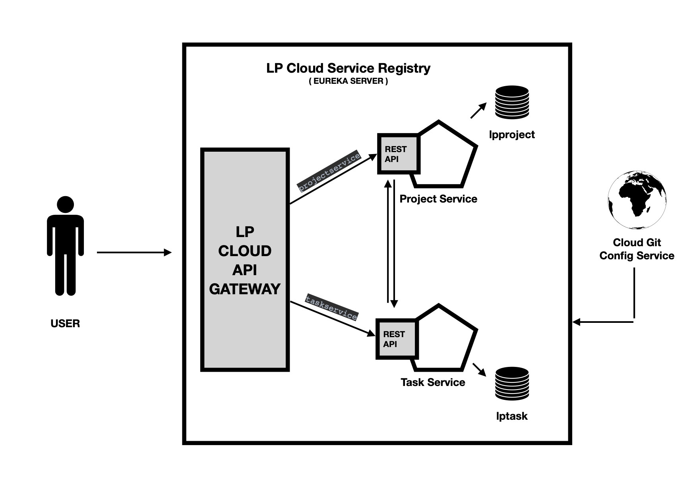

<h3 align="center">:rotating_light: :construction:&ensp;&ensp;Work In Progress&ensp;&ensp;:construction: :rotating_light:</h3>
<h2 align="center">LPTraining </h2>
LP Training code base that belongs to my office work.

<h2>License</h2>

Licenses this source under the <u>MIT License</u>,You may not use this file except in compliance with the License.

<!-- Badges -->

  

<h2>Content&ensp;&ensp;:book: :book:</h2>

<ul>
    <li>lp-assesment-in-one</li>
    <li>lp-assesment-in-two</li>
    <li>lp-capitalization-imp</li>
    <li>lp-exception-imp</li>
    <li>lp-revers-int-imp</li>
    <li>lp-spring-cloud-config-store</li>
</ul> 

  
 

<h2>LP Assesment In One </h2>

 This application base one Java capitalization , exception , revers functions. this is work as a single application and as well as I have implemented each functions individually in below project. 

<h4 align="center">Here is a screenshot of the UI</h4>
<!-- image -->

<h2>LP Assesment In Two </h2>

 Microservices Architecture demonstration project. <B>Project Planneer </b>. User can add Project and Tasks using given API and all CRUD services are implemented in each serives.

<h4 align="center">Here is a screenshot of the Architecture Design</h4>
<!-- image -->

<h2>LP spring cloud config store</h2>

Spring Cloud Config provides server-side and client-side support for externalized configuration in a distributed system. With the Config Server, you have a central place to manage external properties for applications across all environments.

:rocket::rocket:

<ul>
  <li>Default</li>
  <li>Prod</li>
  <li>Dev</li>
  <li>QA</li>
</ul>
