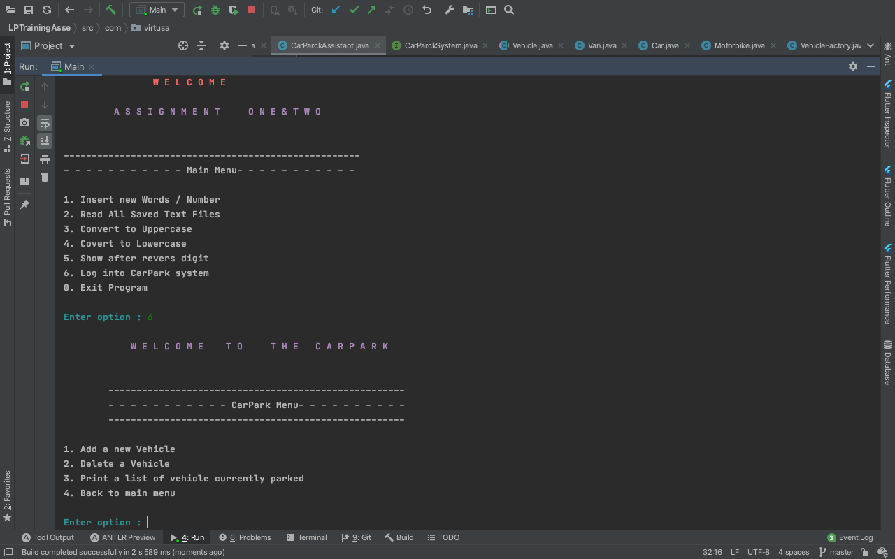

<h3 align="center">:rotating_light: :construction:&ensp;&ensp;Work In Progress&ensp;&ensp;:construction: :rotating_light:</h3>
<h2 align="center">LPTraining </h2>
LP Training code base that belongs to my office work.

<h2>License</h2>

Licenses this source under the <u>MIT License</u>,You may not use this file except in compliance with the License.

<!-- Badges -->

  

  

<h4 align="center">Here is a screenshot of the UI</h4>

<!-- image -->

