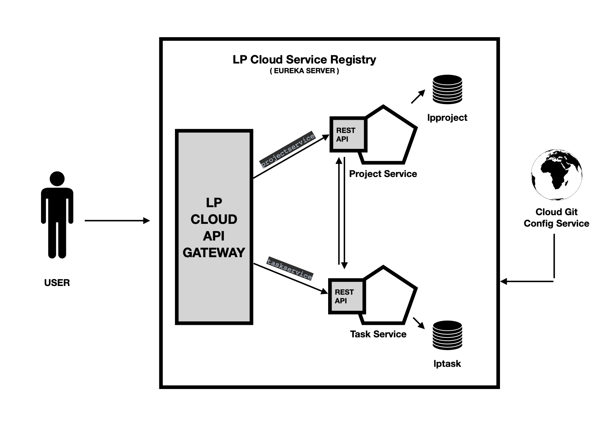

<h3 align="center">:rotating_light: :construction:&ensp;&ensp;Work In Progress&ensp;&ensp;:construction: :rotating_light:</h3>
<h2 align="center">LPTraining Assignment Two </h2>

 

LP Training code base that belongs to my office work. Microservices Architecture demo. Microservices, aka microservice architecture, is an architectural style that structures an application as a collection of small autonomous services, modeled around a business domain. In a Microservice Architecture, each service is self-contained and implements a single business capability.

<!-- Badges -->

  

<h2>Implemented Services &ensp;&ensp;:book: :book:</h2>

<ul>
    <li>LP Cloud Service Registry</li>
      <ul>
        <li> spring: application: name: registry </li>
      </ul>
    <li>LP Spring Cloud Config Server</li>
      <ul>
        <li> spring: application: name: config-server </li>
      </ul>
    <li>LP Spring Cloud API Gateway</li>
      <ul>
        <li> spring: application: name: api-gateway </li>
      </ul>
    <li>LP Spring Cloud Common Models (Simple Maven Project)</li>
    <li>LP Task Component Microserver</li>
      <ul>
        <li> spring: application: name: taskservice </li>
        <li> URL:  <a> http://taskservice/task/* </a>  </li>
      </ul>
    <li>LP Project Component Microserver</li>
      <ul>
        <li> spring: application: name: projectservice </li>
        <li> URL:  <a> http://projectservice/project/* </a> </li>
      </ul>
</ul> 

<h4 align="center">Here is a screenshot of the Architecture Design</h4>
<!-- image -->

